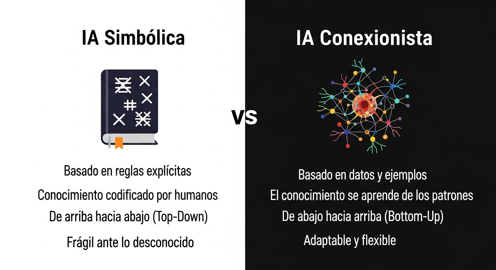

# El Árbol de la Inteligencia Artificial: Orígenes, Ramas y Filosofías

¡Hola y bienvenidos al blog del proyecto **Escudo Cibernético Inteligente (ECI)**! A lo largo de esta serie de artículos, no solo construiremos una herramienta de ciberseguridad avanzada, sino que también desmitificaremos los conceptos que la hacen posible. Nuestro objetivo es crear un escudo que aprenda y se adapte para protegerte de amenazas digitales cada vez más sofisticadas.

Para entender cómo lo haremos, primero debemos viajar a las raíces de la Inteligencia Artificial. Imaginemos la IA como un gran árbol. Sus raíces se hunden en décadas de lógica, matemáticas y filosofía. De su tronco crecen dos ramas principales que representan dos formas muy diferentes de "pensar". Y su follaje es un denso entramado de debates, avances y aplicaciones que definen nuestro mundo actual. En este primer artículo, exploraremos este árbol para entender por qué hemos elegido una rama específica para construir nuestro ECI.

## El Problema a Resolver: ¿Por qué las reglas simples fallan contra el phishing moderno?

Todos hemos recibido ese correo sospechoso. Antes, era fácil de detectar: errores gramaticales, promesas de fortunas o un remitente claramente falso. Podíamos crear reglas simples para bloquearlos: "Si el correo contiene 'lotería' y 'urgente', marcar como spam".

Pero los atacantes han evolucionado. El phishing de hoy es un adversario inteligente, personalizado y psicológicamente astuto. Las viejas reglas ya no son suficientes por varias razones:

*   **Hiper-personalización (Spear Phishing):** El atacante ya te conoce. Usa tu nombre, tu cargo o información de proyectos reales. Un correo que dice "Hola, Ana, te escribo sobre el proyecto ECI que discutimos" es increíblemente convincente.
*   **Perfección Técnica y Visual:** Los atacantes usan IA para redactar correos perfectos y clonan sitios web que son réplicas exactas. La falta de errores ya no es una señal de legitimidad.
*   **Uso de Servicios Legítimos:** El enlace malicioso ya no está en el correo, sino dentro de un documento alojado en Google Drive o Dropbox. El enlace que ves es de confianza, pero el peligro está un paso más allá.
*   **Ingeniería Social Sofisticada:** Ya no apelan solo a la avaricia. Manipulan emociones más poderosas como el miedo ("Tu cuenta será bloqueada"), la autoridad ("Soy tu CEO, haz esta transferencia") o la curiosidad ("Revisa las nuevas nóminas en el adjunto").

Una defensa basada en una lista de "cosas malas conocidas" siempre irá un paso por detrás. Necesitamos un sistema que no solo siga reglas, sino que aprenda a reconocer la intención maliciosa.

## Conceptos Teóricos: Las Dos Grandes Ramas de la IA

Para resolver este problema, debemos entender las dos filosofías principales que han dominado la historia de la IA.

### 1. IA Simbólica o Basada en Reglas (Enfoque Clásico)

Este fue el primer gran enfoque, dominante durante décadas. La idea central es que la inteligencia se puede lograr mediante la manipulación de símbolos (conceptos como "casa", "rojo", "mayor que") de acuerdo con reglas lógicas explícitas. Es un enfoque "de arriba hacia abajo": un experto humano define el conocimiento, y la máquina lo ejecuta.

**¿Cómo funciona?** A través de sistemas expertos. Imagina un sistema para tasar casas:
```
SI el tamaño > 150 m² Y la ubicación = "centro", ENTONCES el precio > 300.000 €.
SI la antigüedad > 20 años, ENTONCES el precio disminuye en 30.000 €.
```
**Su limitación:** Es rígida y frágil. No puede manejar la ambigüedad o situaciones para las que no fue explícitamente programada. No aprende de nuevos ejemplos; un humano debe actualizar las reglas constantemente.

### 2. Machine Learning o Aprendizaje Automático (Enfoque Moderno)

Este es el paradigma que impulsa la revolución actual. En lugar de darle reglas, le damos datos. Es un enfoque "de abajo hacia arriba": la máquina aprende a identificar patrones complejos a partir de miles o millones de ejemplos. Se inspira en cómo las neuronas se conectan en nuestro cerebro, formando redes neuronales artificiales.

**¿Cómo funciona?** Se entrena un modelo con una enorme cantidad de correos, etiquetados como "phishing" o "legítimo". El algoritmo aprende por sí mismo las características sutiles que los distinguen: la estructura de las frases, la reputación de los enlaces, la frecuencia de ciertas palabras, etc.

**Su fortaleza:** Es adaptable y flexible. Si los atacantes cambian de táctica, podemos reentrenar el modelo con nuevos ejemplos para que aprenda a detectar las nuevas amenazas.



## El Debate Filosófico y los Tipos de IA

Mientras construimos sistemas más inteligentes, surgen preguntas profundas. ¿Puede una máquina realmente "pensar"?

*   **El Test de Turing:** Propuesto por Alan Turing, sugiere que, si una máquina puede conversar con un humano sin que este pueda distinguirla de otro humano, entonces exhibe inteligencia. Es una prueba de comportamiento.
*   **El experimento de la Habitación China:** El filósofo John Searle argumentó en contra. Imagina a una persona que no habla chino encerrada en una habitación. Recibe preguntas en chino y, siguiendo un complejo libro de reglas, produce respuestas perfectas sin entender una sola palabra. Para un observador externo, parece que entiende chino. Searle argumenta que así funcionan las computadoras: manipulan símbolos (sintaxis) sin tener una comprensión real de su significado (semántica).

Para nuestro ECI, esta distinción es clave. No necesitamos que nuestro escudo "entienda" el concepto de estafa. Solo necesitamos que sea un "experto en la habitación china" para el phishing: que, siguiendo los patrones aprendidos, clasifique un correo como malicioso con una precisión sobrehumana.

Esto nos lleva a los tipos de IA que existen:

*   **ANI (Inteligencia Artificial Estrecha):** Es la IA que tenemos hoy. Sistemas especializados en una tarea (jugar al ajedrez, conducir un coche, o en nuestro caso, detectar phishing). El ECI será un sistema ANI.
*   **AGI (Inteligencia Artificial General):** Una IA (aún teórica) con la capacidad intelectual de un humano en cualquier dominio. Podría aprender a programar, escribir una novela o componer música con la misma facilidad.
*   **ASI (Superinteligencia Artificial):** Una IA (hipotética) que superaría la inteligencia humana en todos los aspectos, incluyendo la creatividad y la sabiduría.

## La Tormenta Perfecta: Los 3 Ingredientes del Boom Actual de la IA

Si las redes neuronales existen desde hace décadas, ¿por qué la IA está explotando ahora? La respuesta es la confluencia de tres factores que han creado una "tormenta perfecta". Usemos la analogía de hornear un pastel gigante:

1.  **Big Data: El Combustible.** La IA moderna es como un chef que aprende probando. Cuantos más platos prueba, mejor es su paladar. En las últimas dos décadas, hemos generado un tsunami de datos (likes, fotos, búsquedas, compras...). Este es el combustible digital.
2.  **Algoritmos Mejorados: La Receta.** Tener muchos ingredientes no sirve de nada sin una buena receta. La investigación ha producido arquitecturas de software revolucionarias, como los Transformers (la base de modelos como GPT-4), que son increíblemente buenas para entender el contexto y el significado en el lenguaje.
3.  **Poder Computacional: El Horno.** Para cocinar un pastel gigante, necesitas un horno potente. El gran protagonista aquí es la GPU (Unidad de Procesamiento Gráfico). Diseñadas para videojuegos, resultaron ser perfectas para las matemáticas de la IA, reduciendo tiempos de entrenamiento de años a días. El Cloud Computing ha hecho que este poder sea accesible y asequible para todos.

## Aplicación al ECI: ¿Por Qué Machine Learning es la Única Respuesta?

Ahora podemos conectar todos los puntos. La ciberseguridad tradicional, basada en reglas, es como una fortaleza estática. Conoce a sus enemigos por nombre (listas negras) y los detiene en la puerta. Pero es reactiva y no puede detener a un enemigo disfrazado o a uno que nunca ha visto antes (ataques de día cero).

Nuestro ECI, basado en Machine Learning, es un escudo vivo y adaptativo.

*   **Aprende Patrones, no solo Ejemplos:** En lugar de memorizar URLs maliciosas, aprende las características de una URL de phishing. Esto le permite generalizar y detectar amenazas nuevas.
*   **Entiende el Contexto y la Intención:** Usando Procesamiento del Lenguaje Natural (NLP), el ECI "lee" el correo para detectar una falsa urgencia o un tono inconsistente, señales que un sistema de reglas ignora.
*   **Adaptación Continua:** El escudo no es estático. Se reentrenará continuamente con los datos más recientes. Si los atacantes inventan una nueva táctica, el sistema la aprenderá y se fortalecerá.

En resumen, pasamos de un modelo que pregunta "¿He visto esto antes?" a un modelo que pregunta "¿Esto parece sospechoso, basado en todo lo que he aprendido sobre cómo funciona una amenaza?".

Esta es la razón fundamental por la que nuestro Escudo de Ciberseguridad Inteligente se construirá sobre los cimientos del aprendizaje automático. Es la única manera de crear una defensa que no solo responda a las amenazas de hoy, sino que esté preparada para las de mañana.

En el próximo artículo, nos pondremos manos a la obra: exploraremos los tipos de datos que necesitamos para entrenar nuestro ECI y cómo empezaremos a recolectarlos. *¡Hasta la próxima!*
